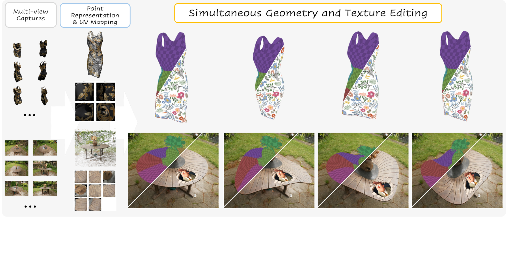

# PointGT: Simultaneous Geometry and Texture Editing for Point-Based Representations (ECCV 2026)
[Yanshu Zhang](https://zvict.github.io/)<sup>1†</sup>, [George Shramko](https://sfuapex.ca/author/george-shramko/)<sup>1</sup>, [Pratul P. Srinivasan](https://pratulsrinivasan.github.io/)<sup>4</sup>, [Ke Li](https://www.sfu.ca/~keli/)<sup>1,2,3</sup><br>
<sup>1</sup>Simon Fraser University &nbsp;&nbsp; <sup>2</sup>Amii &nbsp;&nbsp; <sup>3</sup>CIFAR &nbsp;&nbsp; <sup>4</sup>Google DeepMind &nbsp;&nbsp; (<sup>†</sup>corresponding author)<br>


[Project Page](https://zvict.github.io/pointgt/)
 | [Paper](https://zvict.github.io/pointgt/static/pdfs/paper.pdf)
 | [arXiv](https://arxiv.org/abs/2609.03341)
 | [Video](https://www.youtube.com/watch?v=aHKiGW_okAw) <br>
Primary contact: [Yanshu Zhang](https://zvict.github.io/)




## BibTeX
 <strong>PointGT: Simultaneous Geometry and Texture Editing for Point-Based Representations</strong>. &nbsp;&nbsp;&nbsp;
```
@inproceedings{zhang2026pointgt,
    title={PointGT: Simultaneous Geometry and Texture Editing for Point-Based Representations},
    author={Yanshu Zhang and George Shramko and Pratul P. Srinivasan and Ke Li},
    booktitle={European Conference on Computer Vision (ECCV)},
    year={2026}
}
```

## Installation


```bash
git clone https://github.com/zvict/pointgt
cd pointgt
conda create -n pointgt python=3.11 -y
conda activate pointgt

pip install torch==2.10.0 torchvision==0.25.0 --index-url https://download.pytorch.org/whl/cu128
conda install -c nvidia cuda-toolkit=12.8 -y
export CUDA_HOME="$CONDA_PREFIX"

pip install "git+https://github.com/NVlabs/tiny-cuda-nn/#subdirectory=bindings/torch"
pip install "git+https://github.com/facebookresearch/pytorch3d.git@v0.7.9"

pip install -r requirements.txt
```

## Data Preparation

```
data/
├── nerf_synthetic/lego/{train,val,test}/  transforms_*.json
└── sketchfab/dress1/                      transforms_*.json  r_*.png
```

NeRF Synthetic comes from the [original NeRF release](https://github.com/bmild/nerf).
`python download.py --what demo` provides `dress1`.

The `dress` asset is *Dress with gold leaves* by
[Canvastique3D](https://sketchfab.com/canvastique3d), licensed
[CC BY 4.0](http://creativecommons.org/licenses/by/4.0/). 

## Overview

```
train.py  test.py  train_uv.py  render_edit.py  download.py
models/     point renderer: attention, features, top-k, surface fusion, losses, optim
dataset/    ray generation, patch sampling, scene loading
uv/         multi-chart atlas, texture map, atlas losses
edit/       canonical correspondence and the edit render path
utils/      config merge, geometry, metrics, session setup
configs/    default.yml, default_uv.yml, nerfsyn/, editing/
```

| Stage | Script | What it does |
|---|---|---|
| a | `train.py` | trains the point renderer |
| a | `test.py` | renders the test split, reports PSNR / SSIM / LPIPS |
| b | `train_uv.py` | learns the UV atlas and texture map |
| c | `render_edit.py` | renders a geometry and texture edit |
| — | `download.py` | fetches checkpoints and demo assets |

We release the configs for the NeRF-Synthetic scenes and the `dress` editing scene used in the paper. 

Each scene config merges over `configs/default.yml`, or `default_uv.yml` for stage b. 

## Training

```bash
python train.py --opt configs/nerfsyn/lego.yml
python train.py --opt configs/nerfsyn/lego.yml --resume 1      # continue from save_dir
python train.py --opt configs/editing/dress_papr.yml           # needs depth, see below
```

`--resume` is a gate, not a step number; the step comes from the checkpoint.

### Optional: surface supervision from 2D Gaussian Splatting

Point positions and attention can be optimized toward the depth predicted by
[2D Gaussian Splatting](https://github.com/hbb1/2d-gaussian-splatting) to get a better surface reconstruction. Please follow the instructions below to install 2D Gaussian Splatting and generate the surface supervision data.

```bash
git clone --recursive https://github.com/hbb1/2d-gaussian-splatting.git
cd 2d-gaussian-splatting
conda env create -f environment.yml     # `surfel_splatting`; do not use the pointgt env
conda activate surfel_splatting
pip install submodules/diff-surfel-rasterization submodules/simple-knn

SCENE_SRC=/path/to/data/sketchfab/dress/renderings
MODEL_DIR=/path/to/pointgt/2dgs/sketchfab_9999999999/dress

python train.py  -s "$SCENE_SRC" -m "$MODEL_DIR" --eval --white_background --test_iterations -1 --quiet
python render.py -s "$SCENE_SRC" -m "$MODEL_DIR" --iteration 30000 \
                 --eval --white_background --skip_train --skip_mesh --quiet
```

Configs name depth as `2dgs/...`, resolved against the repository root. Render into `<repo>/2dgs`,
or point `POINTGT_2DGS_ROOT` at your 2DGS output directory.

## Learning the UV atlas

```bash
python train_uv.py --opt configs/editing/dress_uv.yml
```

Consumes a stage-a checkpoint and writes `nuvo_model_with_texture.ckpt` plus the learned texture
map. 

## Editing

```bash
python render_edit.py \
    --opt configs/editing/dress_uv.yml \
    --texture path/to/your_texture.png \
    --pcd_dir demo/dress/rbf_pcds \
    --out results/dress --video
```

`--texture` tiles any image across the atlas charts. `--texture_is_grid` instead takes an
already-packed chart grid, which is what `train_uv.py` writes and the thing to paint on.

`--pcd_dir` supplies the geometry as per-frame PLYs. Point *i* of each frame must be point *i* of
the checkpoint's cloud, since that identity is what makes the canonical transfer well defined.

## Evaluation

```bash
python test.py --opt configs/nerfsyn/lego.yml
python test.py --opt configs/nerfsyn/lego.yml --load_path checkpoints/nerfsyn/lego/model.pth --mask
```

## Pretrained Models

```bash
python download.py --list             # what is available and where it goes
python download.py --what checkpoints # the seven NeRF-Synthetic scenes
python download.py --what demo        # the dress editing demo
python download.py --verify           # re-check sha256 of what is on disk
```

Weights are on [Hugging Face](https://huggingface.co/victor678/pointgt) and land where the configs
expect them. The checkpoint group is more than the seven evaluated models: some scenes fine-tune
from a `base.pth` and some load a fixed initial point cloud, and a retrain without those starts
somewhere else. `--what demo` adds the `dress1` renders, both dress checkpoints, the learned texture
grid and the 35-frame deformed sequence.

## Acknowledgement

PointGT builds on [PAPR](https://github.com/zvict/papr) (NeurIPS 2023), whose point representation,
proximity attention and densification schedule this work extends. The UV atlas follows
[Nuvo](https://pratulsrinivasan.github.io/nuvo/), written from the paper; no Nuvo source was used.
Surface supervision uses [2D Gaussian Splatting](https://github.com/hbb1/2d-gaussian-splatting).

## License

MIT, see [LICENSE](LICENSE). Datasets and 3D assets carry their own licences and are not
redistributed under these terms.
